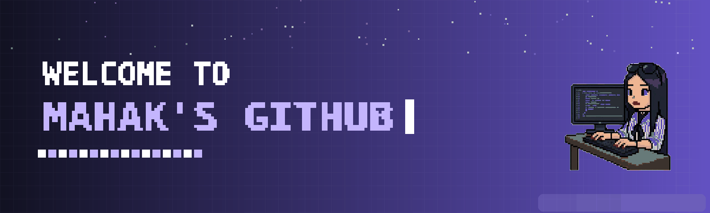

  

  

### $\color{#B39DDB}{\textbf{Connect}}$

  
  
  

### $\color{#B39DDB}{\textbf{Tech Stack}}$

  

  

###  $\color{#B39DDB}{\textbf{Statistics}}$

  

###  $\color{#B39DDB}{\textbf{About Me}}$

<table>
<tr>
<td width="250">

</td>
<td>

Hello! My name is **Mahak Khan**, and I am a BSIT graduate student. I am passionate about learning new technologies, developing innovative projects, and solving complex problems through programming. Currently, I am honing my skills in **JavaScript, React.js, Java, Spring Boot, and SQL**, focusing on building robust applications and continuously growing within the tech industry.

</td>
</tr>
</table>

  

